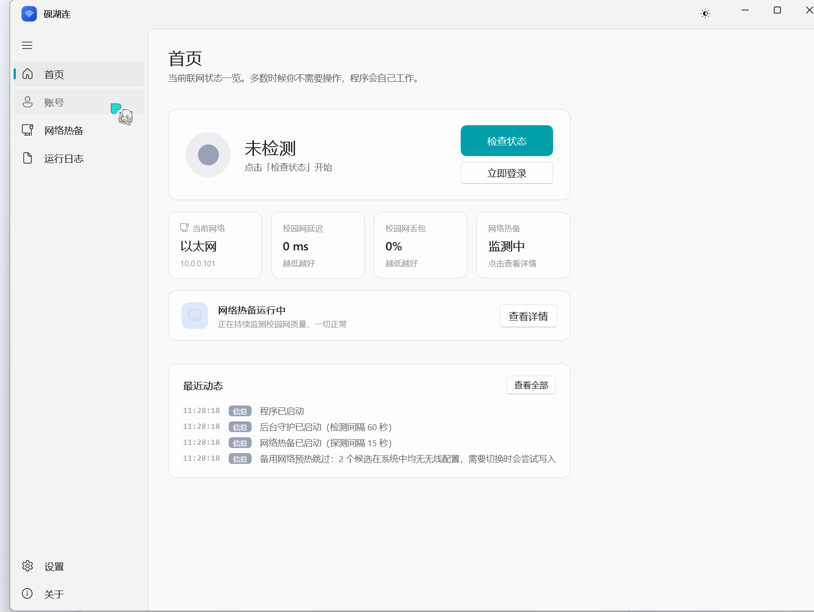

# 砚湖连 · YanhuLink

<div align="center">


**扬州职业技术大学高邮湖校区 · 校园网自动连接工具**

*砚台静置于高邮湖畔，水波之上，一滴水珠 —— 这是我们给「上网」这件事起的一个校园名字。*

基于 **WinUI 3** 打造的现代化 Windows 桌面应用 · 自包含绿色版 · 无需 Python / 无需安装运行时

[](https://github.com/LunaShiori/YanhuLink)
[](https://dotnet.microsoft.com/)
[](https://learn.microsoft.com/windows/apps/winui/)
[](LICENSE)
[](https://github.com/LunaShiori/YanhuLink/releases)

</div>

---

## 关于这个名字

> **砚** 取砚台之意，是高邮湖校区的书卷气；
> **湖** 是高邮湖，也是每天走过的那片水面；
> **连** 既是「连接网络」，也是「把你和校园连起来」。

同学们都管它叫「**砚湖连**」，英文简称 **YanhuLink**。
它的正式身份是：**扬州职业技术大学高邮湖校区校园网自动连接工具**。

---

## ✨ 特性

| | 功能 | 说明 |
|---|---|---|
| 🎨 | **现代化界面** | WinUI 3 + 云母（Mica）材质，圆角卡片，自动跟随系统深浅色 |
| 📦 | **开箱即用** | 自包含 exe，双击即用，**自带 Windows App Runtime，不需要装 Python / .NET / 任何运行时** |
| 🔌 | **断线自动重连** | 后台守护线程定时检测，掉线秒级自动重登 |
| 🛡️ | **网络热备** | 5 秒一轮探测延迟与丢包，故障时**自动切换到手机热点 / 无线网**，恢复后自动切回 |
| 📈 | **速率实时监测** | 首页实时显示上下行速率（读网卡计数，**零额外流量**），并可小样本测速估算链路带宽 |
| 🚀 | **开机自动启动** | 支持注册表自启与**计划任务自启**（后者可免除 UAC 弹窗） |
| 🔐 | **密码加密存储** | 使用 Windows DPAPI（绑定当前用户）加密，非明文 |
| 🖥️ | **系统托盘** | 关闭窗口最小化到托盘，托盘右键菜单快捷操作（含一键切网） |
| 🏢 | **多运营商** | 校园网 / 中国移动 / 中国电信 / 中国联通，后缀可自定义 |
| ⌨️ | **命令行支持** | `--check` / `--login` / `--logout` / `--probe` 等，方便脚本调用 |
| 🔒 | **完全本地** | 只与校园认证服务器通信，不连接任何第三方服务器 |

---

## 📈 速率实时监测

> 打游戏时想知道是不是网卡了？看一眼首页那个数字就知道了。

### 两种数字，别混淆

| 指标 | 含义 | 怎么来的 | 流量成本 |
|---|---|---|---|
| **实时速率** | 你**当前实际**用了多少带宽 | 每 2 秒读一次网卡收发字节数做差 | **零** |
| **链路能力** | 这条校园网**最快能跑多快** | 每 3 分钟重复请求认证服务器上的小页面，累计 ≤384 KB | 约 2 KB/s |

**为什么要分两个？** 只显示"实时速率"的话，你不下载、不打游戏时它恒为 `0 B/s`，看起来像坏了 —— 但那完全正常。所以界面上会写「**当前空闲 · 链路可跑 1.3 Mbps**」，一眼就能区分"没人用网"和"网坏了"。

### 会不会影响正常用网？

**不会。** 这是刻意设计的：

- **实时速率**读的是 `IPv4InterfaceStatistics` 的累计计数器，纯本地读取，**一个字节都不发**
- **链路能力**只在首页可见时才测，单次总流量硬限制在 **384 KB**、超时 3 秒；按 3 分钟一次算，平均占用约 **2 KB/s**（≈ 一条微信消息的 1/10）
- 主动测速**不设代理**、目标就是校园内网的 `172.18.1.6`，不出校门、不过运营商

### 速率过低也会触发切换

现在除了"延迟超标 / 丢包超标"，还多了一条判定：**速率持续低于阈值**（默认 64 KB/s，连续 4 次）。
这专门针对**「认证通了、出口被限速」**这种连着却什么都干不了的场景 —— 延迟和丢包都正常，但打开网页要等半分钟。

> 阈值设为 `0` 即可关闭这一条判定。

---

## 🛡️ 网络热备（重点功能）

> 校园网半夜断网、认证服务器抽风、宿舍网口接触不良 —— 这些场景下你依然能上网。

### 它做什么

```
        ┌─────────────────────────────────────────────────────┐
        │  持续探测校园网（ICMP 延迟 + 丢包）                 │
        └───────────────────────┬─────────────────────────────┘
                                │
            延迟/丢包正常 ······│······ 连续 N 次不健康
                                │
        ┌───────────────────────┴─────────────────────────────┐
        ▼                                                     ▼
   ┌─────────┐                                          ┌───────────┐
   │ 校园网  │  ←── 连续 M 次健康，自动切回 ──┐         │ 备用网络  │
   │ 优先    │                                │         │ 手机热点  │
   └─────────┘                                └─────────│ 其他 WiFi │
                                                        └───────────┘
```

### 判定依据：延迟 + 丢包（不只是"通不通"）

很多"自动切换"工具只判断端口能不能连通 —— 但校园网常见的是**「连着但没网」**：认证服务器端口能通，实际却上不了网。本程序用 **ICMP 探测延迟与丢包率**，只有两者同时达标才算健康：

- **延迟上限**：默认 300ms（可调）
- **丢包上限**：默认 50%（可调）
- **探测目标**：默认 `172.18.1.6`（认证服务器本身，最能反映校园网真实质量）
- **探测间隔**：默认 **5 秒**（可调）

> **5 秒一轮会被限流吗？** 不会。探测走 ICMP，目标是校园**内网**地址，不出校门、不过运营商。
> 每轮 3 个包 × 32 字节，5 秒一轮 ≈ **19 字节/秒** —— 比一条微信消息还小。
> 认证服务器（Dr.COM eportal）只处理 HTTP 认证请求，对 ICMP 无感知，不存在"请求太频繁被封"。
>
> 为什么值得改成 5 秒？因为**打游戏时断网，最痛苦的就是那几十秒的等待**。
> 15 秒一轮 × 连续 3 次 = 最坏 45 秒才切；改成 5 秒后最坏 15 秒内完成切换。

### 切换原理：调整路由跃点数

不插拔网线、不断开现有连接，通过 `SetIpInterfaceEntry` 调整各网卡的 **InterfaceMetric（跃点数）** 改变流量出口：

| 阶段 | 校园网网卡 | 备用网卡 | 效果 |
|---|---|---|---|
| 待命 | 25 | 9000 | 备用网络连着但**不参与选路**，校园网优先 |
| 切换后 | 9000 | 5 | 流量**改走备用网络** |
| 切回后 | 自动 | 自动 | 恢复系统默认选路 |

### 备用网络配置（两种方式都支持）

1. **从系统已保存的 WiFi 中勾选** —— 密码由系统保管，无需重填
2. **手动添加 SSID + 密码** —— 适合临时热点，密码用 DPAPI 加密存储

支持配置**多个**备用网络并调整优先级，按顺序依次尝试。

### ⚠️ 关于管理员权限

修改网卡跃点数**需要管理员权限**。程序的处理策略是「按需提权」：

- **平时**以普通权限运行，登录 / 检测 / 托盘等功能完全不受影响
- **启用网络热备**时，界面会提示并提供「**以管理员身份重启**」按钮
- 若未提权就发生故障，程序会**降级处理**：尽力连上备用 WiFi，并明确告知
  「已连上备用网络，但需管理员权限才能真正接管上网出口」

> **想免除开机 UAC 弹窗？** 提权后，在「网络热备 → 切换条件与阈值」中点击
> 「**改用计划任务**」，程序会注册一个以最高权限运行的开机计划任务，
> 开机时静默启动，不再弹 UAC。

---

## 📸 界面预览

<div align="center">



*首页 —— 联网状态一览，多数时候你不需要操作*

</div>

界面分四块：**首页**（状态一览）· **账号**（运营商与凭据）· **网络热备**（探测与切换）· **运行日志**，
左下角另有 **设置** 与 **关于**。全部本地渲染，无任何网络请求除了校园认证服务器。

---

## 📥 下载安装

前往 [Releases](https://github.com/LunaShiori/YanhuLink/releases) 页面下载：

| 文件 | 说明 |
|---|---|
| `YanhuLink-Setup-x64.exe` | **推荐**：安装包，含桌面快捷方式与卸载项 |
| `YanhuLink-v2.1.0-win-x64-portable.zip` | 绿色版：解压即用，无需安装 |

> **系统要求**：Windows 10 1809（17763）及以上 / Windows 11，x64 架构。
>
> **无需任何前置依赖** —— 发布包已自带 .NET 运行时与 Windows App Runtime。

---

## 🚀 快速上手

1. 打开程序，选择**运营商**（教师选「校园网」，学生选自己办理的运营商）
2. 填写**账号**与**密码**（统一身份认证平台的账号密码）
3. 按需勾选运行选项（推荐开启「后台守护」和「启动时自动登录」）
4. 点击 **保存设置** → **立即登录** 验证
5. 完成！之后开机即自动联网

> 💡 **登录失败提示「账号或密码错误」？** 多半是运营商后缀不对。
> 选中对应运营商，把「账号后缀」改成学校实际使用的后缀
> （移动常见 `@cmcc`、电信 `@telecom`、联通 `@unicom`，校园网留空），
> 点「保存后缀」再试。

### 开启网络热备

1. 在「网络热备」卡片点「**添加热点**」或「**从已保存选择**」，配置至少一个备用网络
2. 打开「启用网络热备」开关
3. 若提示权限不足，点「**以管理员身份重启**」
4. 回到「切换条件与阈值」展开面板，按需调整延迟 / 丢包 / 触发次数
5. 想免除开机 UAC？点「**改用计划任务**」

---

## ⌨️ 命令行用法

```cmd
:: —— 校园网认证 ——
YanhuLink.exe --check        :: 检查登录状态（0=已登录 1=未登录 2=不可达）
YanhuLink.exe --login        :: 立即登录一次（需已保存配置）
YanhuLink.exe --logout       :: 注销当前在线会话

:: —— 网络热备 ——
YanhuLink.exe --net-status   :: 显示当前网络与热备配置
YanhuLink.exe --probe        :: 探测校园网延迟与丢包（0=正常 1=异常）
YanhuLink.exe --switch-backup:: 手动切换到备用网络
YanhuLink.exe --switch-primary:: 手动切回校园网

:: —— 其他 ——
YanhuLink.exe --background   :: 后台守护模式（开机自启使用）
YanhuLink.exe --help         :: 显示帮助
```

所有命令成功返回 `0`，失败返回非 `0`，便于脚本判断。

---

## 🛠️ 从源码构建

### 环境要求

- [.NET 8 SDK](https://dotnet.microsoft.com/download/dotnet/8.0)
- [Windows SDK 10.0.26100+](https://developer.microsoft.com/windows/downloads/windows-sdk/)（WinUI 3 编译必需）
- （可选）[Inno Setup 6](https://jrsoftware.org/isdl.php) —— 生成安装包

### 构建步骤

#### 第 0 步：获取源码

```bash
git clone https://github.com/LunaShiori/YanhuLink.git
cd YanhuLink
```

#### 方式一：一键构建（推荐）

仓库根目录提供了 `build.cmd`，双击即可完成全流程：

```cmd
build.cmd
```

它会自动：发布自包含版 → 精简语言包 → 打包绿色版 ZIP → 调用 Inno Setup 生成安装包。

#### 方式二：手动构建

```bash
# 1. 仅编译（产物依赖系统 Windows App Runtime，仅供本机调试，不要用于分发）
dotnet build src/CampusNetLogin/CampusNetLogin.csproj -c Release -p:Platform=x64

# 2. 发布自包含版（★ 分发必须用这一步）
#    三个关键点：
#      --self-contained true                  → 自带 .NET 运行时
#      -p:WindowsAppSDKSelfContained=true     → 自带 Windows App Runtime
#      -p:PublishSingleFile=false             → 不要用单文件
dotnet publish src/CampusNetLogin/CampusNetLogin.csproj \
  -c Release -r win-x64 -p:Platform=x64 \
  --self-contained true \
  -p:WindowsAppSDKSelfContained=true \
  -p:PublishSingleFile=false \
  -o publish/win-x64

# 3. 打包绿色版（PowerShell）
powershell -NoProfile -Command "Compress-Archive -Path 'publish/win-x64/*' -DestinationPath 'YanhuLink-v2.1.0-win-x64-portable.zip' -Force"

# 4. 生成安装包（需 Inno Setup 6）
#    注意：Inno Setup 官方不含中文语言包，若未装请先执行第 5 步
iscc installer/setup.iss

# 5. （仅首次）安装简体中文语言包
#    从 https://jrsoftware.org/files/istrans/ 下载 ChineseSimplified.isl，
#    放到 <Inno Setup 安装目录>\Languages\ 下
```

产物位于 `publish/win-x64/`（目录）、`build/*.zip`（绿色版）与 `installer/Output/*.exe`（安装包）。

> ⚠️ **务必用 `publish` 产物分发，不要用 `build` 产物，且不要开 `PublishSingleFile`。**
> `dotnet build` 的输出不含 Windows App Runtime，会有概率弹出
> 「This application requires the Windows App Runtime」对话框 ——
> 因为 Runtime 是按**主次版本精确匹配**的，用户即便装了最新版也不管用。
> 单文件打包同样会破坏 WinUI 的 Runtime 解析路径，务必保持 `PublishSingleFile=false`。

### GitHub Actions 自动构建

推送 tag 即自动构建并发布 Release（工作流已内置中文语言包下载与 SHA256 校验和生成）：

```bash
git tag v2.0.0
git push origin v2.0.0
```

---

## 🔬 技术原理

### 校园网认证

本校认证系统为 **Dr.COM 哆点 eportal 4.X**（Portal: `172.18.1.6`）。

| 功能 | 接口 |
|---|---|
| 登录状态查询 | `GET http://172.18.1.6/drcom/chkstatus` （`result:1` = 已登录） |
| 在线详情查询 | `GET http://172.18.1.6:801/eportal/portal/online_list` |
| **登录** | `GET http://172.18.1.6:801/eportal/portal/login` |
| 注销 | `GET http://172.18.1.6:801/eportal/portal/logout` |

- 账号 = 输入账号 + 运营商后缀（如 `2509602125@telecom`）
- `wlan_user_ip` 取**认证服务器看到的客户端 IP**（从首页内嵌 `v4ip` 字段获取），可正确穿透 NAT
- 注销接口固定传 `user_account=drcom&user_password=123`，服务器以 IP + MAC 定位会话
- 密码明文传输（该校 `en_md5:0`），与网页登录行为一致

### 网络热备

| 能力 | 实现方式 |
|---|---|
| 延迟 / 丢包探测 | `System.Net.NetworkInformation.Ping`（ICMP，取多次平均） |
| 活动网卡识别 | `NetworkInterface` + 按跃点数排序 |
| 当前 SSID / 信号 | `wlanapi.dll` → `WlanQueryInterface`（`WLAN_CONNECTION_ATTRIBUTES`） |
| 已保存 WiFi 列表 | `wlanapi.dll` → `WlanGetProfileList` |
| 连接 WiFi | `wlanapi.dll` → `WlanConnect`（`WLAN_CONNECTION_MODE_PROFILE`） |
| 写入 WiFi 配置 | `wlanapi.dll` → `WlanSetProfile`（动态生成 WPA2-PSK profile XML） |
| **改变流量出口** | `iphlpapi.dll` → `SetIpInterfaceEntry` 调整 `InterfaceMetric` |
| 权限检测 / 提权 | `WindowsPrincipal` + `Process.Start(Verb="runas")` |
| 免 UAC 开机自启 | `schtasks /Create /RL HIGHEST /SC ONLOGON` |

> 全部通过 **P/Invoke 直接调用系统 API**，不依赖 `netsh` 命令文本解析，
> 也不引入任何第三方网络库 —— 保持「零外部依赖、自包含发布」的目标。

---

## 📁 项目结构

```
YanhuLink/  (工程代号 CampusNetLogin)
├─ src/CampusNetLogin/              # 主程序（WinUI 3 + C#）
│  ├─ Models/
│  │  ├─ AppConfig.cs               #   配置模型（含热备配置）
│  │  ├─ IspOption.cs               #   运营商定义
│  │  ├─ StatusResult.cs            #   状态与操作结果
│  │  └─ NetworkModels.cs           #   网络探测 / 备用网络 / 热备状态
│  ├─ Services/
│  │  ├─ DrComPortalClient.cs       #   Dr.COM 认证核心（登录/检测/注销）
│  │  ├─ NetworkProbeService.cs     #   网络质量探测（延迟/丢包/活动网卡）
│  │  ├─ WlanService.cs             #   无线网络管理（枚举/连接/写配置）
│  │  ├─ RoutePriorityService.cs    #   接口跃点数读写（切换出口的关键）
│  │  ├─ FailoverService.cs         #   网络热备编排（状态机）
│  │  ├─ ElevationService.cs        #   管理员权限检测 / 提权 / 计划任务
│  │  ├─ PasswordProtector.cs       #   DPAPI 密码加解密
│  │  ├─ ConfigService.cs           #   配置持久化
│  │  ├─ WatchdogService.cs         #   后台守护（断线重连）
│  │  ├─ StartupService.cs          #   开机自启（注册表）
│  │  └─ LogService.cs              #   运行日志
│  ├─ ViewModels/
│  │  ├─ MainViewModel.cs           #   主视图模型
│  │  └─ BackupNetworkItem.cs       #   备用网络可绑定包装
│  ├─ Views/                        #   界面（MainWindow / TrayIcon）
│  ├─ Helpers/                      #   单实例锁 / 值转换器
│  └─ Styles/Theme.xaml             #   样式主题
├─ installer/                       # Inno Setup 安装包脚本
├─ build.cmd                        # 一键构建脚本（绿色版 + 安装包）
├─ .github/workflows/               # GitHub Actions 自动构建
└─ docs/                            # 文档与截图
```

---

## ❓ 常见问题

<details>
<summary><b>程序提示「认证服务器不可达」？</b></summary>

说明当前不在校园网环境（或未连接校园 WiFi / 网线）。连接校园网后重试即可。
</details>

<details>
<summary><b>网络热备提示「需要管理员权限」？</b></summary>

修改网卡跃点数需要管理员权限。点击提示条上的「以管理员身份重启」即可。
登录、检测、托盘等功能不受权限影响，只有**自动切换网络出口**需要提权。

若每次开机都要弹 UAC，可点「改用计划任务」，改由计划任务以最高权限静默启动。
</details>

<details>
<summary><b>热备切换了但好像还是上不了网？</b></summary>

若程序提示「已连上备用网络，但未能修改网络优先级」，说明当前没有管理员权限 ——
备用 WiFi 已连上，但 Windows 仍可能优先走校园网网卡。此时可手动断开校园网，
或以管理员身份重启程序。
</details>

<details>
<summary><b>「终端超限」提示是什么意思？</b></summary>

账号同时在线的设备数超限。请到自助服务平台注销其他设备，
或在本程序点「注销下线」后重新登录。
</details>

<details>
<summary><b>密码保存安全吗？</b></summary>

使用 Windows DPAPI 加密，密钥绑定当前 Windows 用户。换用户或换电脑无法解密。
但请注意：**公用电脑上不建议勾选「记住密码」**。
</details>

<details>
<summary><b>杀毒软件报毒怎么办？</b></summary>

自包含 exe 因打包方式常被误报。本程序修改网络配置的行为也可能触发启发式告警。
可在 [Releases](../../releases) 下载源码自行构建，或为程序添加信任。
本项目完全开源，可审计全部代码。
</details>

<details>
<summary><b>启动时弹出「This application requires the Windows App Runtime」？</b></summary>

说明你用的是 `dotnet build` 产物而非 `dotnet publish` 产物。
请从 [Releases](../../releases) 下载正式发布版本（已自带运行时）。
若自行构建，请使用 README「从源码构建」中的第 2 步命令。
</details>

---

## 📄 许可

[MIT License](LICENSE) © 2026 LunaShiori

本项目仅供学习交流，请在校园网络政策允许的范围内使用。

---

<div align="center">

**立德树人，知行合一**

</div>
